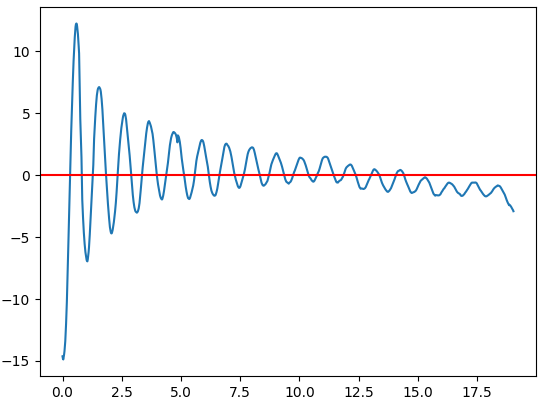

# Schwingungen

## Zusammenhang zwischen Rotation und Schwingung

Zusammenhang ziwschen 2d Projektion einder 3d Rotation -> Zusammenhang Frequenz von federn zu Sinus Funktion

## harmonische Schwingung

Vorraussetzung:
- Schwingungsfähiges System
- lineare Kraftgesetz (Gültigkeig des Hook'schen Gesetzes: $F = D \cdot y$ ) -> Kraft nimt proportional zur Auslenkung zu

### Zum Fadenpendel

Hier Harmonische Schwingung nur bis Auslenkungswinkel < 5° möglich

Differenz zwischen Auslenkung und Zurückzulegender Distanz sind nicht linear zueinander

$ a \approx b $ gilt nur für kleine Winkel

### Zum Federpendel

F = m * a

y''(t) = D/M * y(t)

y(t) = y_max * sin(omega * t)

y'(t) = y_max * omega * cos(omega * t)

y''(t) = y_max * -sin(omega * t) * omega^2

Was bringt das?

    - y_max * omega^2 * sin(omega * t) = - D/M * y_max * sin(omega * t)

    omega^2 = D/M

.

    omega^2 = 4 * pi^2 / T^2 = D / M

    T^2 = 4 * pi^2 / M / D

    T = 2 * pi * sqrt(M/D)

Schwingung eines Harmnonischen Oszillators ist durch diese Formel beschreibbar

Harmonischer Oszillator Vorraussetzungen:

- y(t) = y_max * sin(omega * t)
- Auslenkung y als proportional zur Rückstellkraft F_r

Energie des Hormonischen Oszillators:

E_kin = sin(t)
E_pot = cos(t)

E_ges = E_kin + E_pot = 1

## Experiment: "Gedämpfte Schwingung"

Newtons 3. Axiom: F_1 = -F_2

